# Snippets

> My personal snippets, tests, and things that are too small to have their own repo :)

## Todo

- [ ] add a demo
- [ ] compress repo-banner output with svgo
- [ ] let repo-banner find the color in manifest.json or index.html files
- [ ] banner is displayed full width, so the height should be reduced by 40%
- [ ] banner should be able to show something else than github + ts : vue + ts, vue + js, js, ts, etc

## Thanks

- [Eslint](https://eslint.org) : super tool to find & fix problems
- [Github](https://github.com) : for all their great work year after year, pushing OSS forward
- [Repo-checker](https://github.com/Shuunen/repo-checker) : eslint cover /src code and this tool the rest ^^
- [Shields.io](https://shields.io) : nice looking badges to be proud of
- [Shuutils](https://github.com/Shuunen/shuutils) : collection of pure JS utils
- [V8](https://github.com/demurgos/v8-coverage) : simple & effective cli for code coverage
- [Vitest](https://github.com/vitest-dev/vitest) : super fast vite-native testing framework

## Stargazers over time

## Page views

