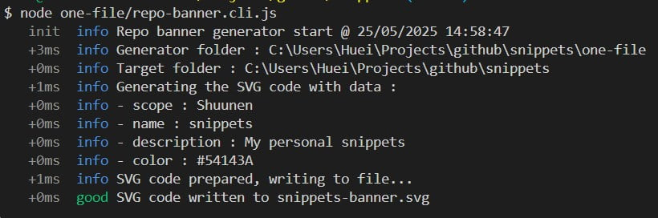

# Snippets

[](https://codeclimate.com/github/Shuunen/snippets)
[](https://github.com/Shuunen/snippets/blob/master/LICENSE)


> My personal snippets, tests, and things that are too small to have their own repo :)

## Tools

### Repo Banner

In a terminal, cd to the root of your repo and run:

```bash
node path/to/one-file/repo-banner.cli.js
```

Here is the output of the cli running on this repository :



It will generate a `<project-name>-banner.svg` file that you can use in your README.md file, here is the output for this repository :


## Todo

- [ ] compress repo-banner output with svgo
- [ ] let repo-banner find the color in manifest.json or index.html files
- [ ] banner is displayed full width, so the height should be reduced by 40%
- [ ] banner should be able to show something else than github + ts : vue + ts, vue + js, js, ts, etc

## Thanks

- [Boxy Svg](https://boxy-svg.com) : simple & effective svg editor
- [Bun](https://bun.sh) : super fast runtime for JavaScript and TypeScript
- [Github](https://github.com) : for all their great work year after year, pushing OSS forward
- [Repo-checker](https://github.com/Shuunen/repo-checker) : eslint cover /src code and this tool the rest ^^
- [Shields.io](https://shields.io) : nice looking badges to be proud of
- [Shuutils](https://github.com/Shuunen/shuutils) : collection of pure JS utils
- [Svg Omg](https://jakearchibald.github.io/svgomg/) : the great king of svg file size reduction
- [V8](https://github.com/demurgos/v8-coverage) : simple & effective cli for code coverage
- [Vitest](https://github.com/vitest-dev/vitest) : super fast vite-native testing framework

## Stargazers over time

[](https://starchart.cc/Shuunen/snippets)

## Page views

[](https://github.com/Kumara2mahe/Views-Counter)
