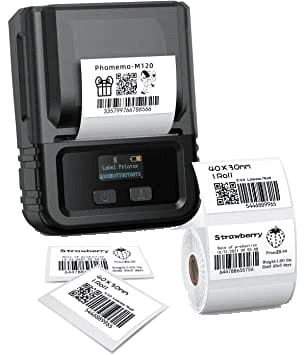
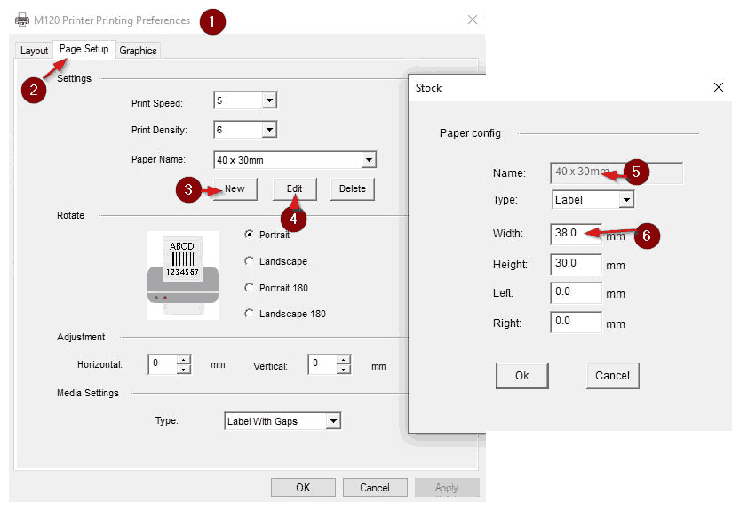
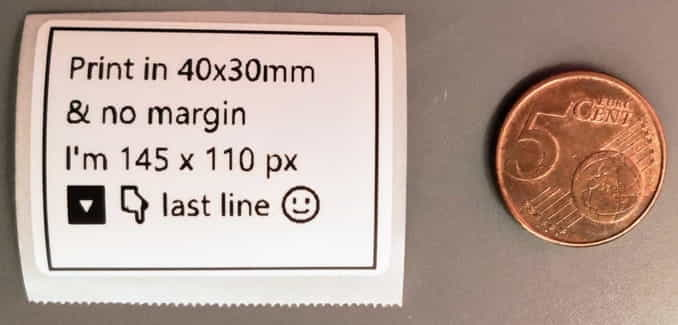

# Phomemo m120 Bluetooth & USB thermal printer



## Details

| Property            | Value                                          |
| ------------------- | ---------------------------------------------- |
| Brand               | Phomemo (also sold as QUIN M120)               |
| Type                | Thermal label printer                          |
| Label sizes         | 40×20mm (mine), accept from 20mm to 50mm width |
| Paper types         | Thermal, sticker, continuous, black mark       |
| Resolution, density | 203 DPI                                        |
| Protocol            | ESC/POS raster via official QY driver          |
| USB Vendor:Product  | `0483:5740` (STMicroelectronics VCP firmware)  |
| USB Serial          | `P0V00000011N`                                 |
| CUPS printer name   | `M120`                                         |
| Bluetooth name      | `Q158G2140250018`                              |
| USB name            | `M120 Printer`                                 |
| Battery             | 1200mAh Lithium battery                        |
| Print speed         | 50 to 70 mm/s                                  |
| Connectivity        | Bluetooth, Micro USB                           |

- [product link](https://phomemo.com/products/m120-label-maker)
- [comparison table with other models](https://phomemo.com/pages/label-maker-information-chart-1)
- [android app](https://play.google.com/store/search?q=print%20master&c=apps&ref=YEDcBw8ldgwQZx)
- [manual](https://delivery.shopifyapps.com/-/62e46e21da81a208/312a0810a8a19c65?ref=YEDcBw8ldgwQZx)

## Remarks

1. I tried to connect to it via Bluetooth but the printer was not recognized successfully by Windows 10.
2. Also I found [on this Chrome thread](https://support.google.com/chrome/answer/6362090) that Chrome does not support Bluetooth printers if they are not BLE (Bluetooth Low Energy) compatible. Not sure if it's the case for this printer.
3. The connection via USB is working fine, the printer is recognized as a printer and can be used as such.

## Setup

### Windows

1. Turn on the printer
2. Connect it via USB
3. Download & execute `QY_Printer Driver Setup v2.11.0.004.exe` from [Phomemo](https://phomemo.com/en-fr/pages/download-for-phomemo-m120-label-printer), [direct link](https://oss.qu-in.life/app/M120-win.zip)
4. Restart your computer
5. Open `Printers & scanners` Windows settings, you should see the `M120 Printer`
6. Click on it, then click on `Printing preferences`

Now :



1. Click on `Printing preferences`
2. Go to "Page Setup" tab
3. Add a new paper size
4. Or edit an existing one
5. Type the name that will be displayed in the print sizes list
6. Remove few mm from the width to avoid the printer to cut the paper too early

For example, I created :

- a `40 x 30mm` paper size with `38 x 30mm` dimensions
- a `40 x 20mm` paper size with `38 x 20mm` dimensions

### Linux

```bash
# 1. Install CUPS
sudo apt-get install -y cups unzip
sudo systemctl enable --now cups

# 2. Install the official QY driver
# Get `QY Label Printer v1.8.0 - Driver Linux` from [Phomemo](https://phomemo.com/en-fr/pages/download-for-phomemo-m120-label-printer) or from the Driver folder
unzip "Phomemo M120 - QY Label Printer v1.8.0 - Driver Linux.zip"
cd "Phomemo M120 - QY Label Printer v1.8.0 - Driver Linux"
sudo bash install

# 3. Set 40×20mm label size and gap tracking as defaults
lpoptions -p M120 -o PageSize=Custom.108x57
lpoptions -p M120 -o zeMediaTracking=Gap
```

### Linux (old instructions)

1. Install `Phomemo M120 - QY Label Printer v2.0.0 - Driver Linux` (not sure where I found the v2 version as the official website only provides v1.8.0) from [Phomemo](https://phomemo.com/en-fr/pages/download-for-phomemo-m120-label-printer), [direct link](https://oss.qu-in.ltd/Phomemo/QY_Printer_Driver_Linux.zip)
2. Turn on the printer
3. Connect it via USB
4. Install the ppd from this repo `apps/config-sync/files/phomemo-m120.ppd`
5. Open `Printers` settings
6. Go to `Printer options` set `Media tracking` to `Gap` and `Vertical offset` to `-1mm`
7. If the printer keep printing vertical instead of horizontal, set rotation to `90°` in this same screen

## Printing from a webpage

After a dozen of tries, I managed to find the good conditions.

**First follow the [setup](#setup) instructions above.**

Then, open this [CodePen](https://codepen.io/Shuunen/pen/vYjvMPE) or in a webpage use following code :

```html
<div class="overflow-hidden border border-black p-2 text-sm" style="width:145px; height: 110px; aspect-ratio: 4/3;">
  Print in 40x30mm<br />
  & no margin<br />
  I'm 145 x 110 px<br />
  🔽 👇 last line 🙂
</div>
```

Open the print modal via Ctrl+P or the browser menu.

Set the following options :

- **Destination : M120 Printer**
- Pages : All (default)
- Copies : 1 (default)
- Layout : Portrait (default)
- **Paper size : 40 x 30mm**
- Pages per sheet : 1 (default)
- **Margins : None**
- Scaling : Default (default)
- Background graphics : unchecked (default)
- Selection only : unchecked (default)

Then print !

You should get something like this :



## FAQ

### What does the official driver setup script do ?

The `install` script:

- Copies the compiled `rastertolabelmxxx` filter to `/usr/lib/cups/filter/`
- Copies PPDs to `/usr/share/cups/model/qy/`
- Registers the M120 printer in CUPS via the bundled `qyInstall` binary
- Restarts CUPS

### What is the latest official driver ?

As of June 2026, the official driver is **QY_Printer-1.8.0.002** from `QY_Printer_Driver_Linux.zip`.

It installs a compiled `rastertolabelmxxx` binary that:

- Accepts CUPS raster format (including v3, produced by CUPS 2.4.7+)
- Handles gap detection internally — no manual form-feed commands needed
- Positions each label correctly with no cumulative drift

The PPD uses:

```text
*cupsFilter: "application/vnd.cups-raster 0 rastertolabelmxxx"
```

### What are the USB interfaces of the printer ?

The printer presents three USB interfaces:

- **Interface 0** — USB Printer class (used by CUPS)
- **Interface 1** — CDC ACM / virtual serial (unused)
- **Interface 2** — CDC Data (unused)

### What is the page size for 40×20mm labels ?

The QY driver follows the same convention as the Windows driver: the printable width is 38mm (108pt), not the physical 40mm. Height is 20mm (57pt).

```bash
lpoptions -p M120 -o PageSize=Custom.108x57
```

Or pass it per job:

```bash
lp -d M120 -o PageSize=Custom.108x57 yourfile.pdf
```

### Jobs complete in CUPS but nothing prints

Check the filter:

```bash
file /usr/lib/cups/filter/rastertolabelmxxx
# must be: ELF 64-bit LSB pie executable ...  (the official binary)
# if it says "Python script" the custom filter is still installed — re-run setup.sh
```

### Labels drift (each print shifted further)

Gap tracking is not enabled:

```bash
lpoptions -p M120 -o zeMediaTracking=Gap
```

### "Printer drivers are deprecated" warning

Harmless warning from CUPS 2.4.x. The printer still works.

## USB Device Details

```text
Bus 003 Device 002: ID 0483:5740 STMicroelectronics Virtual COM Port
  Interface 0: Printer class — Driver=usblp — used by CUPS
  Interface 1: Communications (CDC ACM) — no driver
  Interface 2: CDC Data — no driver
```

CUPS device URI: `usb:///M120?serial=P0V00000011N`
