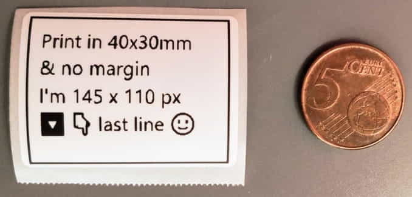

# Phomemo m120 Bluetooth & USB thermal printer


## Details

- [product link](https://phomemo.com/products/m120-label-maker)
- [comparison table with other models](https://phomemo.com/pages/label-maker-information-chart-1)
- [android app](https://play.google.com/store/search?q=print%20master&c=apps&ref=YEDcBw8ldgwQZx)
- [manual](https://delivery.shopifyapps.com/-/62e46e21da81a208/312a0810a8a19c65?ref=YEDcBw8ldgwQZx)
- Connectivity : Bluetooth, Micro USB
- Print Tech : Thermal Direct
- Bluetooth name : Q158G2140250018
- USB name : M120 Printer
- Density : 203 dpi
- Print speed : 50 to 70 mm/s
- Battery : 1200mAh Lithium battery
- Protocols : ESC, POS & TSPL
- Handled paper size width : from 20 to 50 mm
- Handled paper types : thermal, sticker, continuous, black mark

## Remarks

1. I tried to connect to it via Bluetooth but the printer was not recognized successfully by Windows 10.
2. Also I found [here](https://support.google.com/chrome/answer/6362090) that Chrome does not support Bluetooth printers if they are not BLE (Bluetooth Low Energy) compatible. Not sure if it's the case for this printer.
3. The connection via USB is working fine, the printer is recognized as a printer and can be used as such.
  
## Setup

### Windows

1. Turn on the printer
2. Connect it via USB
3. Download & execute `QY_Printer Driver Setup v1.2.10.exe` from [Phomemo](https://phomemo.com/en-fr/pages/download-for-phomemo-m120-label-printer), [direct link](https://oss.qu-in.life/app/M120-win.zip)
4. Open `Printers & scanners` Windows settings, you should see the `M120 Printer`
5. Click on it, then click on `Manage`

Now :


1. Click on `Printing preferences`
2. Go to "Page Setup" tab
3. Add a new paper size
4. Or edit an existing one
5. Type the name that will be displayed in the print sizes list
6. Remove few mm from the width to avoid the printer to cut the paper too early

For example, I created :

- a `40 x 30mm` paper size with `38 x 30mm` dimensions
- a `40 x 20mm` paper size with `38 x 20mm` dimensions

### Linux

1. Turn on the printer
2. Connect it via USB
3. Install the provided `Phomemo-M120.ppd`
4. Open `Printers` settings
5. Go to `Printer options` set `Media tracking` to `Gap` and `Vertical offset` to `-1mm`

## Printing from a webpage

After a dozen of tries, I managed to find the good conditions.

__First follow the [setup](#setup) instructions above.__

Then, open this [CodePen](https://codepen.io/Shuunen/pen/vYjvMPE) or in a webpage use following code :

```html
<div class="border border-black text-sm p-2 overflow-hidden" style="width:145px; height: 110px; aspect-ratio: 4/3;">
  Print in 40x30mm<br>
  & no margin<br>
  I'm 145 x 110 px<br>
  🔽 👇 last line 🙂
</div>
```

Open the print modal via Ctrl+P or the browser menu.

Set the following options :

- __Destination : M120 Printer__
- Pages : All (default)
- Copies : 1 (default)
- Layout : Portrait (default)
- __Paper size : 40 x 30mm__
- Pages per sheet : 1 (default)
- __Margins : None__
- Scaling : Default (default)
- Background graphics : unchecked (default)
- Selection only : unchecked (default)

Then print !

You should get something like this :


